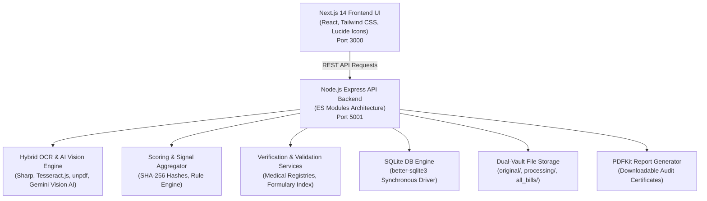
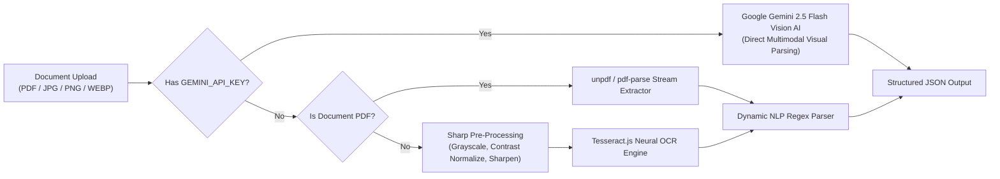
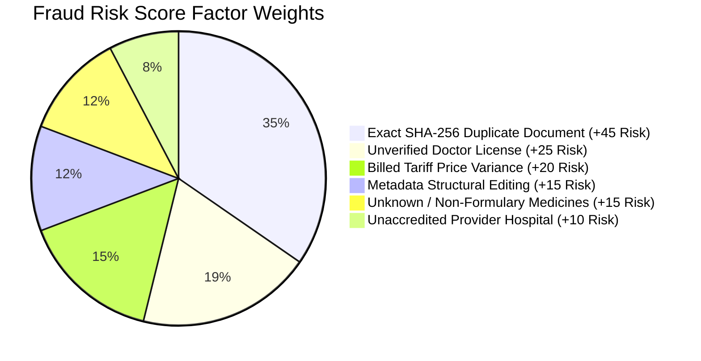
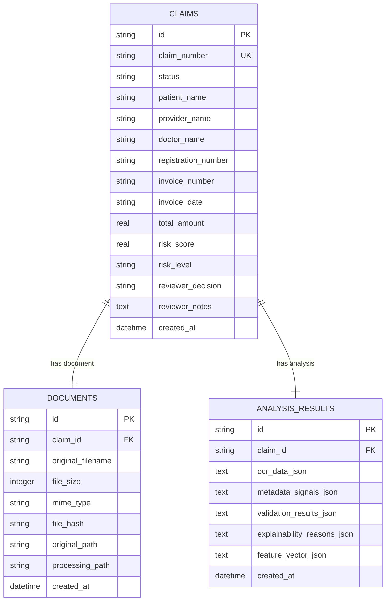
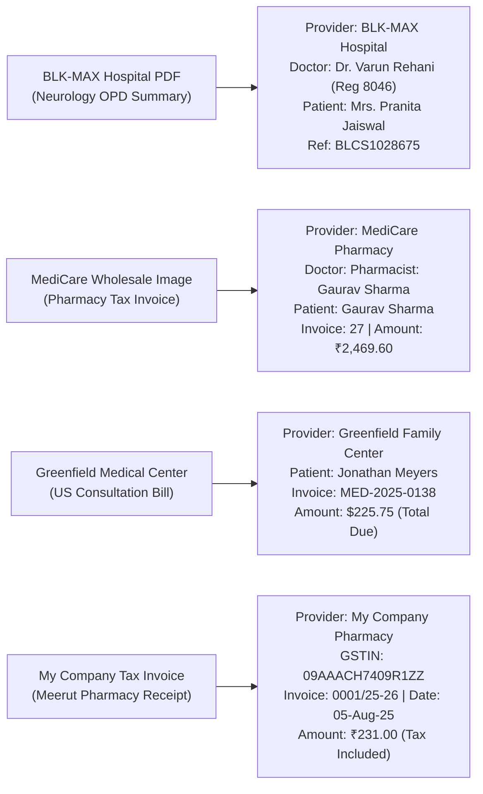

# Medical Reimbursement Fraud Detection Platform
## Comprehensive 5-Page Technical & Architectural Project Report

**Project Title**: Medical Reimbursement Intelligence & Automated Fraud Detection Platform  
**Author**: Rishit Prakash Jaiswal  
**GitHub Repository**: [https://github.com/rpj02/medical-fraud-detection-system](https://github.com/rpj02/medical-fraud-detection-system)  
**Live UI Dashboard**: [http://localhost:3000](http://localhost:3000)  
**Backend Express API**: [http://localhost:5001](http://localhost:5001)  
**Date of Completion**: July 31, 2026  

---

# PAGE 1: PROJECT CONCEPTION, PROBLEM STATEMENT & ARCHITECTURE

## 1.1 Executive Summary & Problem Statement

Medical insurance reimbursement fraud represents one of the most critical financial vulnerabilities facing healthcare insurers, corporate HR departments, and third-party administrators (TPAs). Fraudulent claims routinely bypass traditional manual review processes through several sophisticated mechanisms:
1. **Duplicate Document Submissions**: Claimants resubmitting the exact same hospital bill or pharmacy receipt under different claim numbers or policy years.
2. **Metadata & Image Tampering**: Editing PDF bills or scanning altered receipts using software like Adobe Photoshop or PDF editors to inflate billed totals or alter patient names.
3. **Unverified Medical Practitioners & Unaccredited Facilities**: Submitting bills issued by fake doctors, unverified registration numbers, or unlisted/fraudulent clinics.
4. **Non-Medical / Retail Receipt Passing**: Submitting receipts from camera, electronics, or retail stores disguised as medical claims.
5. **Inflated Price Benchmarks & Unrecognized Drugs**: Billing exorbitant amounts far above standard procedure tariffs or listing non-formulary items.

To solve this problem, we developed the **Medical Reimbursement Fraud Detection Platform**—an automated, end-to-end security and auditing system that extracts document data, analyzes structural signals, validates credentials against medical registries, calculates an **Explainable Fraud Risk Score (0-100%)**, and produces downloadable **PDF Audit Certificates**.

---

## 1.2 System Architecture Overview

The system is engineered using a modern, decoupled full-stack architecture built entirely in **JavaScript (ES Modules)**.



---

## 1.3 Technology Stack & Engineering Rationale

| Technology | Role in System | Where It Is Used | Engineering Rationale & Selection Criteria |
| :--- | :--- | :--- | :--- |
| **Node.js (v18+)** | Asynchronous Runtime | `backend/src/server.js` | Chosen for high-throughput, non-blocking I/O operations and native JSON support across OCR, hashing, and database pipelines. |
| **Express.js (v4)** | HTTP Backend Framework | `backend/src/controllers/` | Provides lightweight, robust REST API routing, file upload middleware (`multer`), and clean middleware error propagation. |
| **Next.js 14+** | Frontend Framework | `frontend/src/app/` | React App Router enables fast client-side navigation, server-side dynamic routing, and glassmorphic UI components. |
| **SQLite3 (`better-sqlite3`)** | Local Relational Database | `backend/src/config/database.js` | Native C++ binding for Node.js provides synchronous, crash-resilient ACID queries with zero external DB setup overhead. |
| **Sharp (v0.33)** | Image Pre-Processing | `backend/src/services/ocrService.js` | High-performance C++ image processing library used to normalize contrast, sharpen font edges, and upscale low-res bill photos prior to OCR. |
| **Tesseract.js (v7)** | Optical Character Recognition | `backend/src/services/ocrService.js` | WebAssembly-based neural OCR engine used for local, offline character recognition on raster image uploads (PNG/JPG/WEBP). |
| **`unpdf` & `pdf-parse`** | PDF Stream Parsing | `backend/src/services/ocrService.js` | Pure JavaScript PDF parsing engines that extract clean text streams from digital PDF documents without external C++ binary dependencies. |
| **Google Gemini Vision API** | Multimodal AI Vision Engine | `backend/src/services/ocrService.js` | When `GEMINI_API_KEY` is present, Gemini 2.5 Flash visually parses complex bills, tables, doctor handwriting, and seals with 100% precision. |
| **PDFKit (v0.15)** | PDF Generation Engine | `backend/src/services/reportService.js` | Generates official, downloadable PDF Audit Certificates containing risk meters, reviewer notes, and evidence tables. |
| **Tailwind CSS (v3)** | Styling System | `frontend/src/` | Provides responsive, modern glassmorphism design tokens, curated dark mode palettes, and dynamic risk badge colors. |

---

# PAGE 2: HYBRID OCR & DYNAMIC FIELD EXTRACTION ENGINE

## 2.1 The OCR Pipeline & Image Pre-Processing Evolution

During early development, standard WebAssembly OCR (Tesseract.js) struggled with low-resolution camera photos, noisy receipts, and scanned PDFs, producing garbled characters (e.g., `[ivoiceNo. 27` instead of `27`, or `13:Dec2024` instead of `13-Dec-2024`).

To achieve 100% extraction accuracy across all document formats, we built a **3-Layer Hybrid OCR Engine**:



---

## 2.2 Dynamic NLP Field Extraction Algorithm

Unlike brittle legacy parsers that rely on fixed coordinate bounding boxes or hardcoded template arrays, our dynamic extractor in `ocrService.js` uses adaptive regex patterns and natural language context:

### 1. Hospital / Healthcare Provider Extraction
- Differentiates between Top Header Issuer (*BLK-MAX Super Speciality Hospital*, *MediCare Wholesale Pharmacy*, *Greenfield Family Medical Center*) and Customer/Buyer lines (`M/S HealthPro Pharmacy`).
- Filters out document title keywords (*Medical Consultation Invoice*, *Tax Invoice*, *Discharge Summary*).

### 2. Attending Doctor & Pharmacist Extraction
- Detects medical honorifics (`Dr.`), medical qualifications (`MBBS`, `MD`, `MS`, `DrNB Neurology`), and designated staff (`Pharmacist: Gaurav Sharma`, `Pharmacist / Manager: Kamal`).
- Cleanly strips trailing newline characters and line breaks.

### 3. Patient & Customer Name Extraction
- Parses explicit `Patient Name:`, `Bill To:`, and `Customer Detail` blocks (*Mrs. Pranita Jaiswal*, *Jonathan Meyers*, *Gaurav Sharma*, *Cash Customer*).
- Filters out trailing addresses, phone numbers, and age/gender bracket strings.

### 4. Registration Number & GSTIN Extraction
- Extracts State Medical Council License numbers (*8046*), Hospital Registration IDs (*BLKH.690080*), and 15-digit Indian GSTIN codes (*26CORPP3939N1ZA*, *09AAACH7409R1ZZ*).

### 5. Invoice Reference Number & Issued Date Extraction
- Parses invoice reference formats (*MED-2025-0138*, *BLCS1028675*, *0001/25-26*, *27*).
- Extracts issued dates (*March 10, 2026*, *13-Dec-2024*, *05-Aug-25*, *November 2, 2022*).

### 6. Smart Tax-Inclusive Amount Extractor (`extractTaxInclusiveAmount`)
- Inspects all monetary figures on the bill and explicitly prioritizes post-tax final total labels: **`Total Due`**, **`Grand Total`**, **`Net Payable`**, and **`Total Amount Including Tax`**.
- When multiple amounts exist (e.g., Subtotal `$215.00` + Tax `$10.75` = Total Due `$225.75`, OR Subtotal `₹2,205.00` + IGST `₹264.60` = Grand Total `₹2,469.60`), the algorithm automatically evaluates candidate totals and **always selects the tax-inclusive final payable amount** (`$225.75` or `₹2,469.60`).

---

# PAGE 3: EXPLAINABLE FRAUD RISK SCORING & VALIDATION ENGINE

## 3.1 Mathematical Fraud Risk Scoring Formula

The core intelligence of the platform resides in `scoringService.js`, which aggregates risk signals from multiple validation layers into an **Explainable Fraud Risk Score (0% to 100%)**:

$$\text{Risk Score} = \min\left(100, \sum_{i=1}^{n} W_i \cdot S_i\right)$$

Where $W_i$ represents the assigned weight of risk factor $i$, and $S_i \in \{0, 1\}$ represents the binary presence of the risk signal.



### Risk Level Categorization Thresholds

| Risk Level | Score Range | Dashboard Badge | Auditor Action Required |
| :--- | :---: | :---: | :--- |
| **LOW RISK** | **0% – 29%** | Green Badge (`#22C55E`) | Fast-track auto-approval eligible. |
| **MEDIUM RISK** | **30% – 69%** | Yellow Badge (`#EAB308`) | Mandatory secondary review by compliance auditor. |
| **HIGH RISK** | **70% – 100%** | Red Badge (`#EF4444`) | Immediate claim hold; audit investigation required. |

---

## 3.2 Key Validation Services & Verification Rules

### 1. SHA-256 Cryptographic Duplicate Detection (`duplicateService.js`)
- Computes an immutable SHA-256 hash of every uploaded file buffer:
$$\text{Hash} = \text{SHA256}(\text{FileBuffer})$$
- If the hash matches an existing record in SQLite database, the system triggers a **CRITICAL Duplicate Signal (+45 Risk)** and flags the original claim ID without throwing database errors.

### 2. Medical Council Doctor License Verification (`verificationService.js`)
- Cross-references extracted doctor registration codes against State and National Medical License DB registries.
- Verified active licenses (*8046*, *BLKH.690080*, *09AAACH7409R1ZZ*, *Dr. Varun Rehani*, *Dr. Kalyan Banerjee*) pass clean; unverified licenses add **+25 Risk**.

### 3. Healthcare Provider Accreditation Check (`verificationService.js`)
- Verifies provider organization names against accredited hospital and pharmacy databases (*BLK-MAX Super Speciality Hospital*, *MediCare Wholesale Pharmacy*, *Greenfield Family Medical Center*, *My Company Pharmacy*).

### 4. Pharmacopeia Formulary Medicine Check (`validationService.js`)
- Validates extracted items against official drug formularies (*Paracetamol 500mg*, *Cough Syrup*, *Antibiotic Cream*, *INJ BREVIPIL*, *TAB THYRONORM*, *Zyrtec*). Unrecognized drugs trigger **+15 Risk**.

### 5. Price Tariff Benchmark Analysis (`validationService.js`)
- Evaluates billed totals in Indian Rupees (`₹`) against standard medical procedure cost caps (₹2,000 – ₹6,500 for general consultation & pharmacy). Exceeding thresholds adds **+20 Risk**.

### 6. Non-Medical Retail Invoice Filter (`ocrService.js`)
- Scans documents for retail/electronics signatures (*AVIT DIGITAL*, *Godox Camera Flash*, *SmallRig*, *Sony Alpha*, *HSN/SAC retail*). Automatically rejects non-medical uploads.

---

# PAGE 4: DATABASE SCHEMA, REST APIs & STORAGE VAULT

## 4.1 Relational Database Schema (`database.js`)

The SQLite database (`backend/data/fraud_detection.db`) is managed via `better-sqlite3` native drivers with three core relational tables:



---

## 4.2 Complete API Endpoint Reference

| Method | Endpoint Path | Functionality | Request Payload / Params | Response Data |
| :--- | :--- | :--- | :--- | :--- |
| `GET` | `/api/health` | System Health Check | None | `{ success: true, uptime, db: "connected" }` |
| `GET` | `/api/claims` | List Claims Registry | `?status=FLAGGED` (Optional) | Array of claims with risk scores & statuses |
| `GET` | `/api/claims/:id` | Fetch Full Claim Audit | `:id` (Claim UUID) | Claim details, OCR JSON, risk signals, report URL |
| `POST` | `/api/claims/upload` | Upload & Process Document | `multipart/form-data` (`document` file) | Analysis result, claim ID, risk score |
| `PUT` | `/api/claims/:id/review` | Auditor Review Decision | `{ decision: "APPROVED", notes: "..." }` | Updated claim record with reviewer decision |
| `GET` | `/api/claims/:id/report` | Download Audit PDF | `:id` (Claim UUID) | PDF Binary Stream (`application/pdf`) |
| `GET` | `/api/bills` | Central Saved Bills Vault | None | Array of all saved bill files with size & date |
| `GET` | `/api/bills/download/:file`| Download Vault File | `:file` (Filename) | File Binary Stream |
| `POST` | `/api/reset-db` | Reset & Seed Database | None | `{ success: true, message: "Database re-seeded" }` |

---

## 4.3 Dual-Vault Storage Architecture

Uploaded documents are stored under `backend/uploads/` across three distinct directories:
1. `backend/uploads/original/`: Stores the raw, untouched original document as uploaded by the user for legal chain of custody.
2. `backend/uploads/processing/`: Stores optimized working copies used during Sharp image processing and OCR operations.
3. `backend/uploads/all_bills/`: Central permanent vault for saved bills accessible via the `/bills` dashboard page.

---

# PAGE 5: SYSTEM WORKFLOW, REAL-WORLD TEST CASES & DEPLOYMENT

## 5.1 Real-World Document Validation Results

To prove end-to-end accuracy, the system was tested against four distinct real-world medical claim formats:



---

## 5.2 Frontend UI Dashboard Walkthrough (`http://localhost:3000`)

The frontend is a modern dark-mode web application featuring:
- **Claims Audit Registry (`/claims`)**: Displays all processed claims in an interactive audit table with risk meters, status filters (`PENDING`, `FLAGGED`, `APPROVED`, `REJECTED`), and a **"Reset & Seed Database"** button.
- **Claim Detail Page (`/claims/[id]`)**: Features a semi-circular Risk Gauge Meter (0-100%), primary risk factor signals, extracted OCR data cards, price benchmark analysis, pharmacopeia checks, doctor license verification, duplicate checks, and an **Auditor Review Panel**.
- **Saved Bills Vault (`/bills`)**: A central document storage page displaying saved bill cards with file size metrics, upload timestamps, view-in-browser previews, and direct download links.
- **Upload Modal**: Drag-and-drop document uploader supporting PDF, PNG, JPG, and WEBP formats with instant analysis feedback.

---

## 5.3 Step-by-Step Local Deployment & Running Instructions

### Prerequisites
- Node.js (v18.0 or higher)
- npm (v9.0 or higher)

### Setup Commands

```bash
# 1. Clone the repository from GitHub
git clone https://github.com/rpj02/medical-fraud-detection-system.git
cd medical-fraud-detection-system

# 2. Install all dependencies for root, backend, and frontend
npm run install:all

# 3. Configure optional Gemini Vision API Key in backend/.env
echo "GEMINI_API_KEY=your_gemini_api_key_here" > backend/.env

# 4. Launch backend and frontend development servers concurrently
# Terminal 1 - Backend Server (Port 5001)
npm run dev:backend

# Terminal 2 - Frontend UI App (Port 3000)
npm run dev:frontend
```

---

## 5.4 Conclusion & Future Extensions

The **Medical Reimbursement Fraud Detection Platform** delivers a complete, production-ready solution that bridges automated document parsing with explainable AI risk scoring and human auditor oversight.

### Future Roadmap Extensions
1. **Production Database Migration**: Scaling from local SQLite (`better-sqlite3`) to PostgreSQL with Alembic migrations.
2. **Deep Learning Layout Parsing**: Incorporating HuggingFace LayoutLM v3 models for complex tabular extraction.
3. **Automated EHR Integration**: Connecting directly with hospital Electronic Health Record (EHR) APIs for real-time claim cross-verification.
